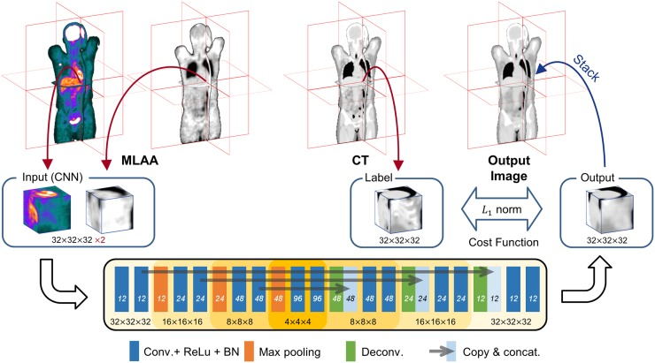

# DL for $\mu$-MLAA enhancement in ToF PET
Implementation of "Generation of PET Attenuation Map for Whole-Body Time-of-Flight 18F-FDG PET/MRI Using a Deep Neural Network Trained with Simultaneously Reconstructed  Activity and Attenuation Maps" (Hwang et al., 2019).

The input of the network is $\lambda$-MLAA and $\mu$-MLAA, the activity and attenuation estimates obtained with a MLAA reconstruction.

Using the parallelproj library.
