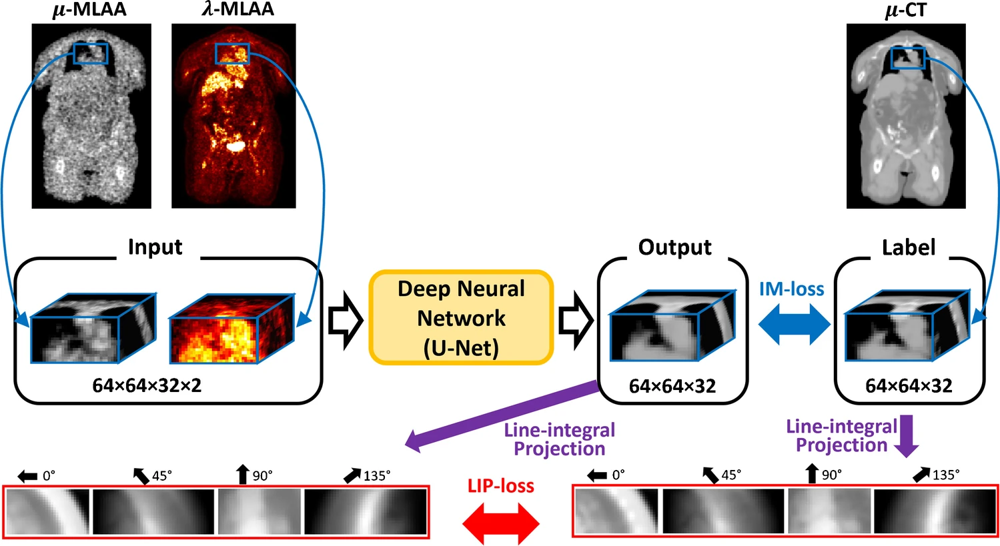

# DL for $\mu$-MLAA enhancement in ToF PET
Unofficial implementation of "Generation of PET Attenuation Map for Whole-Body Time-of-Flight 18F-FDG PET/MRI Using a Deep Neural Network Trained with Simultaneously Reconstructed Activity and Attenuation Maps" (Hwang et al., 2019) [[link](https://doi.org/10.2967/jnumed.118.219493)].

|  |
|:--:| 
| *Architecture of the U-Net used for enhancement. From Hwang et al.* |

Projections are made using the parallelproj library [[docs](https://parallelproj.readthedocs.io/)] [[GitHub](https://github.com/gschramm/parallelproj/)].
